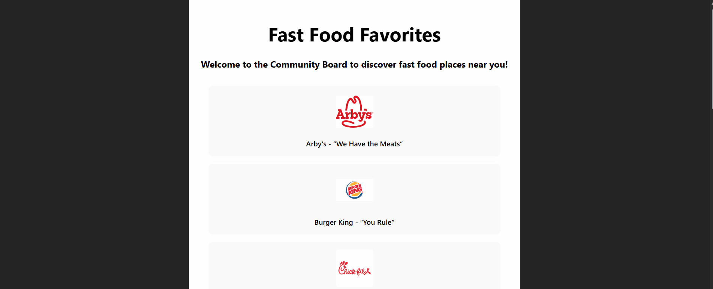

# Web Development Project 1 - *Fast Food Favorites*

Submitted by: **America Gaona Borges**

This web app: **Presents a list of the most popular fast food chains and their slogans.**

Time spent: **2.5** hours spent in total

## Required Features

The following **required** functionality is completed:

- [x] **The app has a cohesive, unique theme for events or resources relevant to a specific community**
  - [x] Header/title describing the theme is displayed
- [x] **At least 10 unique events or resources are displayed in a responsive card format**
  - [x] There are at least 10 cards displayed 
  - [x] The cards should be displayed in an organized format (ex. a grid, or in one line)
  - [x] Each card should include some information about the event or resource

The following **optional** features are implemented:

- [ ] Buttons or links to a related resources are on each card component
  - [ ] All cards have buttons or links in addition to text
- [ ] The site is responsive for both desktop and mobile formats
  - [ ] Web app is shown in a mobile format
  - [ ] **Video Walkthrough Special Instructions**: To ease the grading process, please use Chrome Developer Tools' "Toggle Device" button to demonstrate that your web application's responsiveness in both a desktop *and* a mobile format. Detailed instructions can be found below this stretch feature on the project page. 

The following **additional** features are implemented:

* [ ] List anything else that you added to improve the site's functionality!

## Video Walkthrough

Here's a walkthrough of implemented required features:

GIF created with [ScreenToGif](https://www.screentogif.com/) for Windows

## Notes

It took me a while to get the logos positioned where I wanted them; however, after researching React's capabilities, I got it how I intended. I want to continue improving this, for example, by adding a link to the website to see the menu or order it by distance. 

## License

    Copyright 2025 America Gaona Borges

    Licensed under the Apache License, Version 2.0 (the "License");
    you may not use this file except in compliance with the License.
    You may obtain a copy of the License at

        http://www.apache.org/licenses/LICENSE-2.0

    Unless required by applicable law or agreed to in writing, software
    distributed under the License is distributed on an "AS IS" BASIS,
    WITHOUT WARRANTIES OR CONDITIONS OF ANY KIND, either express or implied.
    See the License for the specific language governing permissions and
    limitations under the License.